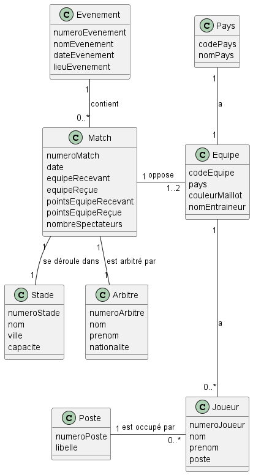

# Modélisation NoSQL de la coupe du monde de Rugby

1. [Diagramme UML](Diag.puml)

2. Voici les structures JSON correspondantes:
   - [Orienté Matchs](orienteMatchs.json)
   - [Orienté Equipes](orienteEquipes.json)

3. La collection orientée équipes semble être la plus adaptée pour créer la base MongoDB.
   En effet, la plupart des requêtes concernent les informations sur les joueurs et les équipes, qui sont toutes contenues dans le document sur les équipes. 
   De plus, les informations sur les matchs sont également incluses dans ce document, ce qui permet de répondre aux questions concernant les matchs.
4. Voici les données de la base ProjetRugby, collection equipes: [ProjetRugby.equipes](ProjetRugby.equipes.json)